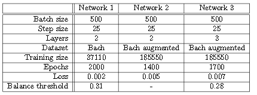

# advanced-machine-learning

# Introduction
At its core, music is a highly structured and methodical art-form.  There is a large range that has been produced,and is still being created;  from basic,  melodic nursery-rhymes,  to complex,  polyphonic Baroque concertos ormore modern bass-heavy dance tracks.  All of these pieces follow a hierarchical structure, at a variety of levels.The  overall  structure  of  a  piece  follows  a  pattern,  with  sections  like  verses  and  choruses  giving  a  sense  offamiliarity for the listener.  However, there is pattern and structure all the way down to individual notes, withmotifs commonly repeating throughout musical pieces [1] (and even between them, as is common in the case offilm scores).Although the appreciation of music, as with any art-form, is highly subjective, there are certainly formulaeand rules which govern our immediate perception to different pieces.  For instance, core features like key type(major  or  minor),  tempo,  and  timbre  all  affect  the  overall  feeling  of  a  musical  piece,  and,  at  a  lower  level,note harmonies have a strong influence on our perception of a the section; dissonant chords are surprising, andsometimes repulsive, but diatonic chords (major and minor) provide comfortable listening.These structures and rules encourage the exploration of using learning machines to generate new music.  Thetest is to see if these rules can be learnt and used to create subjectively enjoyable music.  In this project, thesequential nature of music is exploited with RNNs and LSTMs.  Music is simplified to just a sequence in timeof pitches and durations, and used to train a network, to generate new music from a seed.

# Perception and Representation of Music
## Corpus
The music21library  from  MIT  contains  a  corpus  of  thousands  of  pieces  [6].   We  use  this  library,  and  thecontained corpus to view, process and source all the data for this project.  Specifically, the Bach pieces were used.

## Music Representation
There  are  many  complexities  in  music  notation  such  as  note  accents  and  changing  time  signatures.   For  thepurposes of this basic investigation into the feasibility of using neural networks to generate music, it was decidedto strip each piece of such complexities, focusing on the two main defining features in music;  note pitch andduration.  Only the top (highest in pitch) instrumental part of each piece was considered, as this was assumedto contain the main melody.

## Piano Roll
The most basic network-compatible music representaiton available is the piano roll.  The vertical position of each strip contains pitch information, and the horizontal time axis gives information about the start and end times, and thus the duration. By discretising the time axis into small timesteps, the piano roll can be converted into a long series (in time)of one-hot vectors representing the pitch.  This allows multiple notes to beonat each time step, retaining somepolyphonic musical features, and also allowing rests to be represented.

## Augmented Piano Roll
The representation outlined above is limited in its invariance to music starting in different keys, andis prone to over-fitting.  To increase the invariance, and augment our dataset in an attempt to generate betterresults, each piece from the corpus was transposed up a major third, down a major third, up an octave, anddown an octave.  This gave five times the number of training pieces (including the original key).

# Architecture
Deep learning techniques were tested with the datasets described above.  Based on the ability of deepneural networks to approximate non-linear relations, it was hypothesised that given adequate training, networksthat are able to process streams of data through time could learn some of the underlying rules that govern musictheory.Variations of recurrent neural networks best fit the team’s purposes.  RNNs’ outputs are a function of boththe data inputs at a given timestep and their previous outputs, which provides the ability to analyse an inputsequence coherently.  This implementation used the Python TensorFlow API [8].

| Hyperparameter | Value
| ------------- | ------------- |
| No.  inputs  | 127|
| No.  recurrent cell neurons  | 150|
| No.  hidden layers | 2 |
| Batch normalisation momentum  | 0.9|
| Adamlearning rate  | 0.001
| Training batch size  | 500|

## LSTM Cells
The main advantage in implementing deep learning algorithms in Tensorflow has beenthe ease of transition to more complex models.  The problem ofcatastrophic forgettingarises from a network’slimited memory capacity.  The RNN architecture does not allow for dynamic memory recall,  which in musictheory is essential.  Specifically, while short sequences can be remembered, the network may easily deviate fromthe key of a piece.  This crucial obstacle is partially overcome with the use of LSTM cells instead of simplerecurrent neurons.  Theircell stateandforgetvariables allow the model to store more generalised informationconcerning the training data.  As a result, more complex note sequences are generated, without losing musicalcoherence.

# Results
The  networks  developed  during  this  study  were  trained  on  the  Google  Cloud  Compute  Engine  on  virtualmachines with 24 CPU cores.  A GPU would allow for faster training, which might improve the resulting musicgeneration, but unfortunately was not available.The networks were trained on a corpus of 400 Bach songs obtained using themusic21Python library, asdescribed  in  section  3.   Augmenting  the  dataset  by  transposing  the  music  generated  a  new  dataset  of  2000pieces.  Three LSTM networks were trained, each with slightly different parameters.  They all produced somevery interesting results, and their differences are outlined in table 2.  Network 1 seemed to learn which notesshould go together in chords,  but also made some interesting patterns in time using both chords,  and singlenotes.  The network also made use of musical rests, although not very frequently.  Networks 2 and 3 were trainedon the augmented dataset.  Due to the increase in the quantity of data, training was much slower.  Due to timerestrictions,  networks  2  and  3  were  trained  for  fewer  epochs.   The  output  vector  from  network  2  had  valuesmuch higher than 1 (in the order of 1020), so it could not be used for music generation with the current set up.The output vectors from network 3 had much more reasonable values, bounded by 0 and 0.4, which allowed formusic generation using the existing software.

To generate the music, the network was given 30 time steps, filled with musical rests (no notes being played),as a seed.  Using this, they predicted the next value, which was then appended to the end of the sequence, and5
fed into the network for the subsequent time step.  A part of a pre-existsing musical piece can also be used as aseed, and the network will continue to generate from the end of the provided seed.  The output from the LSTMis a vector of 127 values from 0 to 0.4.  A threshold was set to convert these to a one hot vector representation.Any value higher than the threshold would be changed to 1 and any value lower would become 0.  The thresholdwas varied over the available range, generating different pieces of music.  With a high threshold, the networkgenerated simple music, often with one, or few notes playing simultaneously.  Lowering the threshold assertednotes generated with lower confidence by the network, producing music that appears more messy, dissonant,and complex.  However, if the threshold was set too high, the network generated very long pauses with somenotes in between.  An attempt to find the balance point for each network was made; producing mildly complex,polyphonic, and playful music. 

Sample piece generated:https://www.youtube.com/watch?v=HHRIzfl12fk.
Thresholding network 1:https://www.youtube.com/watch?v=s-Balq1Z4gc.
Thresholding network 3:https://www.youtube.com/watch?v=k5-xQpvUG7s.

# References
[1]  B. Sievers, L. Polansky, M. Casey, and T. Wheatley, “Music and movement share a dynamic structure thatsupports universal expressions of emotion,”Proceedings of the National Academy of Sciences, vol. 110, no. 1,pp. 70–75, 2012.
[2]  A. van den Oord, S. Dieleman, and H. Zen, “Wavenet:  A generative model for raw audio — deepmind,”2016. [Online]. Available:  https://deepmind.com/blog/wavenet-generative-model-raw-audio/
[3]  “Magenta,” 2018. [Online]. Available:  https://magenta.tensorflow.org
[4]  I. Simon and S. Oore, “Performance rnn:  Generating music with expressive timing and dynamics,” 2017.[Online]. Available:  https://magenta.tensorflow.org/performance-rnn
[5]  F. BRINKKEMPER, “Analyzing six deep learning tools for music generation - the asimov institute,” 2016.[Online]. Available:  http://www.asimovinstitute.org/analyzing-deep-learning-tools-music/
[6]  “Music21  -  user’s  guide,  chapter  11:    Corpus  searching  —  music21  documentation,”  2018.  [Online].Available:  http://web.mit.edu/music21/doc/usersGuide/usersGuide11\corpusSearching.html
[7]  “Midi specification,” 2018. [Online]. Available:  https://www.midi.org/specifications
[8]  A. G ́eron,Hands-on machine learning with Scikit-Learn and TensorFlow, 1st ed.    O’Reilly Media, 2017
